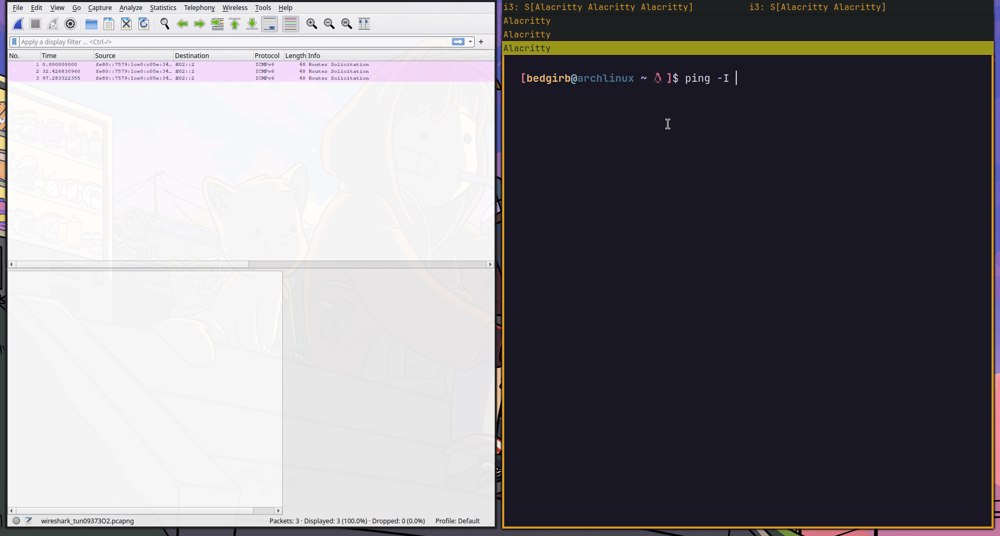

# Ging 
simple echo reply icmp protocol implementation. Highly inspired from [TCP/IP IMPLEMENTATION](https://www.youtube.com/watch?v=bzja9fQWzdA) by Jon Gjengset. *Only the echo reply is implemented*

### Executing program
```bash
./run.sh #giving net cap
ping -I tun0 192.168.0.9
```
### Raw packets 



### Resources:
[RFC792 - ICMP](https://datatracker.ietf.org/doc/html/rfc792)
[RFC791 - IP](https://datatracker.ietf.org/doc/html/rfc791)

